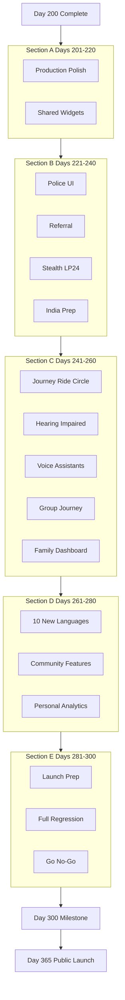

# ZapSafe Frontend — Days 201-300 DETAILED INSTRUCTIONS
## Complete Step-by-Step Explanations (No Code — AI Builds It)

**Purpose:** This document explains WHAT to build and WHY for Days 201-300, detailed enough that any AI agent can implement screens, polish, and wiring without guessing context.

**Project path:** `C:\Users\hridy\Desktop\zapsafe\letsstartbuilding\zapsafe_mobile`

**Starting point:** Day 200 complete (`day200_grand_finale_screen.dart` — Grand Finale milestone).

**Phase:** Production polish, catch-up features from original roadmap, v9.1 advanced UI, international expansion prep.

**Total duration:** 100 days (Days 201-300)

**New screens / flows added:** ~100 day-screens (one primary deliverable per day) + polish passes on existing 200 screens

**New subscriptions needed:** **ZERO** (see Subscriptions section at bottom)

**Backend status at start of this phase:** ~Day 89 (analytics live). Many Day 201-300 UIs use **mock data** until backend catches up.

---

## 📱 SCOPE DECISION: PHONE-ONLY (NO WEARABLES)

**Product scope for Days 201-300:** Flutter **phone app only** (Android + iOS).

| In scope | Out of scope (skip entirely) |
|----------|------------------------------|
| Android + iOS smartphone app | Apple Watch / watchOS companion |
| Phone widgets (home screen) | Wear OS companion |
| Phone sensors (GPS, mic, camera, IMU, biometrics) | Wearable pairing APIs |
| Hardware triggers (volume, power, shake) on **phone** | Heart rate from watch |
| Voice assistants via **phone** (Siri / Google Assistant) | Native watch apps |

**What to do if you previously planned wearables:** Do **not** build Days 241-245 as watch screens. This document replaces them with **core phone safety flows** (Journey Mode, Trusted Circle, Ride Safety, Fake Call, Offline SOS). No watch hardware, no watch subscriptions, no `wearables` backend APIs until a future phase (Day 301+).

**Optional later:** If wearables return in v9.2+, add a new `DAYS_301_330_WEARABLES_OPTIONAL.md` — not part of this 100-day plan.

---

## TABLE OF CONTENTS

1. [AI Agent Operating Rules](#ai-agent-operating-rules)
2. [Backend Conflict-Avoidance Strategy](#backend-conflict-avoidance-strategy)
3. [Section A: Production Polish (Days 201-220)](#section-a-production-polish-days-201-220)
4. [Section B: Catch-Up Screens (Days 221-240)](#section-b-catch-up-screens-days-221-240)
5. [Section C: Core Phone Features + Accessibility (Days 241-260)](#section-c-core-phone-features--accessibility-days-241-260)
6. [Section D: i18n Expansion + Family (Days 261-280)](#section-d-i18n-expansion--family-days-261-280)
7. [Section E: International & Launch Prep (Days 281-300)](#section-e-international--launch-prep-days-281-300)
8. [API Contracts Summary](#api-contracts-summary)
9. [Subscriptions & Services](#subscriptions--services)
10. [Day 300 Milestone Checklist](#day-300-milestone-checklist)

---

## AI AGENT OPERATING RULES

Every day in this document follows the same implementation contract. **Read this section before building any day.**

### Standard deliverables per day

| # | Deliverable | Location |
|---|-------------|----------|
| 1 | New screen file | `lib/presentation/screens/day{N}_{snake_case_name}_screen.dart` |
| 2 | Route constant | `AppRoutes.*` in `lib/presentation/navigation/app_router.dart` |
| 3 | GoRoute entry | Same file — wire path, builder, no auth guard unless noted |
| 4 | Nav index tile | `lib/presentation/screens/day5_navigation_index_screen.dart` — `_NavTile` with `dayBuilt: 'DAY {N} ✅'` |
| 5 | Library doc header | Top-of-file `///` block: day number, purpose, tag (🟢/🟡/🔵), 1-line summary |
| 6 | Design system | Use `ZapColors`, `ZapTypography`, `ZapSpacing`, `ZapButton`, `ZapCard`, etc. — **no hardcoded hex** |
| 7 | i18n | All user-visible strings via `tr()` / `easy_localization` keys in `assets/translations/en.json` (+ hi.json for critical flows) |
| 8 | Semantics | `Semantics(label: ...)` on every interactive element (WCAG / TalkBack) |
| 9 | Touch targets | Minimum **75×75 dp** on all tappable controls |
| 10 | Mock flag | `const bool kUseMockData = bool.fromEnvironment('USE_MOCK_DATA', defaultValue: true);` for 🟡 screens |

### Safety-critical rules (never break)

1. **ALERT_PENDING** must never show the word "SOS" (LP27).
2. **Duress PIN** fake-cancel must look identical to real cancel (LP3).
3. **Stealth/decoy modes** must not weaken hardware SOS triggers when app is backgrounded or killed.
4. **Rooted devices** — warn only, never block SOS.
5. **No analytics/Sentry** on PIN entry, ALERT_PENDING, SOS Active, Evidence Vault, Medical Card.

### Polish-day rules (Days 201-220)

Polish days modify **existing** screens OR ship a **meta-screen** (audit runner, checklist) that documents fixes. When polishing an existing screen:

- Preserve behavior; improve visuals, states, copy, animations.
- Add before/after notes in the day-screen's doc header.
- Do not delete features or routes.

### File header template

```dart
/// Day {N} — {Short title}
///
/// {One paragraph: what this screen does}
/// Tag: 🟢 FRONTEND-ONLY | 🟡 MOCK-NOW | 🔵 EXISTING-API | 🟣 POLISH
///
/// Route: {AppRoutes.constant}
library;
```

---

## BACKEND CONFLICT-AVOIDANCE STRATEGY

> **Frontend and backend never merge code files.** They meet only at **API contracts** (URL + JSON shape).

### Conflict tags (used throughout)

| Tag | Meaning | AI action |
|-----|---------|-----------|
| 🟢 **FRONTEND-ONLY** | No backend ever. Local storage, OS APIs, static UI. | Build fully functional now. |
| 🟡 **MOCK-NOW** | Backend API not built yet. | Mock data + document contract in this file. Swap mock when live. |
| 🔵 **EXISTING-API** | Backend already live (auth, SOS, contacts, analytics, etc.). | Wire to real `api_client.dart` / services. |
| 🟣 **POLISH** | Improves existing screen; may use mock or live. | Edit existing files + optional demo screen. |

### Backend already live (use 🔵 where applicable)

- Auth: register, verify-otp, refresh, logout
- SOS trigger + escalation
- Contacts CRUD
- Notifications (push/SMS)
- GPS batch, evidence metadata
- ML: detection log, model versioning, phone capability
- Analytics: sos-summary, detections, contacts/response-rate, device-health
- i18n: `/api/v1/i18n/languages/`

### Backend NOT live yet (use 🟡 + contracts in this doc)

- Account: consent sync, export, deletion, audit-log, retention, sessions
- Police integration APIs
- Referral / gamification backend
- Group journey / family dashboard APIs
- Counselor WebSocket (UI exists; may stay mock)

**Explicitly excluded from this phase:** `/api/v1/wearables/*` — no wearable backend until phone app ships.

---

# SECTION A: PRODUCTION POLISH (Days 201-220)

**Goal:** Turn 200 "day-screens" into production-quality UX before adding major new features. No new subscriptions. Mostly 🟣 POLISH and 🟢 meta-screens.

**Why this section exists:** Day 1-200 followed "one screen per day" — many screens are functional demos, not polished products. Original Month 8-11 plan called for performance profiling, dark-mode audit, and regression testing **before** v9.1 features.

---

## Day 201: Real Device QA Harness 🟢 FRONTEND-ONLY

### What This Screen Does
Interactive checklist for testing on **physical** Android/iOS devices (not emulator). Categories: microphone, accelerometer, GPS, camera, background service persistence, biometric, push token.

### User Flow
1. Open from nav index → "Day 201 · Device QA"
2. See 12 test cards grouped by category
3. Tap "Run" on each → shows pass/fail/manual-step instructions
4. Export summary as shareable text (clipboard)

### What To Build
- 3-tab layout: **Hardware** | **Background** | **Sign-off**
- Each test: icon, title, steps, Pass / Fail / Skip buttons
- Progress bar: X/12 complete
- Celebration card at 100%

### Files
- `day201_device_qa_harness_screen.dart`
- Route: `/device-qa-harness`

### Time Estimate: 1 day

---

## Day 202: Dashboard Notification Hierarchy 🟣 POLISH

### What This Screen Does
**Polish** the production dashboard (and ship a demo day-screen showing the pattern). Implement 3-tier inline notifications:

| Tier | Color | Behavior | Example |
|------|-------|----------|---------|
| Critical | Red | Must acknowledge | Battery &lt;10%, evidence limited |
| Important | Orange | Dismissible | Unverified Tier 2 contact |
| Suggestion | Blue | Low priority | Monthly drill due |

### What To Build
- New widget: `dashboard_notification_banner.dart` (if not exists)
- Day screen demonstrates all 3 tiers with toggles
- Wire pattern into dashboard placeholder / future production dashboard

### Files
- `day202_dashboard_notifications_screen.dart`
- Optional: `lib/presentation/widgets/dashboard_notification_banner.dart`

### Time Estimate: 1 day

---

## Day 203: SOS Long-Press Ring Animation 🟣 POLISH

### What This Screen Does
Circular fill animation around SOS button during 2-second long-press: gray → red clockwise fill, haptic intensifies, release early shows brief "Cancelled" flash.

### What To Build
- `CustomPainter` or `flutter_animate` ring
- Demo screen with isolated SOS button + haptic feedback
- Document integration point for dashboard

### Safety
- Long-press duration stays **2 seconds** — do not change trigger timing.

### Files
- `day203_sos_long_press_ring_screen.dart`

### Time Estimate: 1 day

---

## Day 204: Persistent Mode Status Card 🟣 POLISH

### What This Screen Does
Upgrade small mode badge into expandable top card: mode + color animation, battery icon, last DCS score, tap to expand details.

### Modes (colors from design system)
MINIMAL (gray), MONITORING (teal/safe), ELEVATED (warning), HIGH (orange-red), CRITICAL (danger + pulse).

### Files
- `day204_mode_status_card_screen.dart`
- Widget: `mode_status_card.dart`

### Time Estimate: 1 day

---

## Day 205: Onboarding Skip Paths 🟣 POLISH

### What This Screen Does
Polish onboarding so **Medical Card** and **Tier 2 contact** are skippable with "Skip for now" — Protection Score reflects incomplete setup.

### What To Build
- Day screen: interactive 5-step onboarding mock with skip buttons
- Score delta display: "+15 if you add medical card"
- Update onboarding flow docs in screen header

### Files
- `day205_onboarding_skip_paths_screen.dart`

### Time Estimate: 1 day

---

## Day 206: Evidence Vault Search & Filter 🟣 POLISH

### What This Screen Does
Add filters to vault list: date range, trigger type (manual/AI/fall/drill), status (resolved/FP/drill), tamper flag.

### What To Build
- Filter chips + date range picker
- Search by SOS ID or date string
- Mock 8-10 vault entries for demo
- Empty state when filters match nothing

### Files
- `day206_vault_search_filter_screen.dart`

### Time Estimate: 1 day

---

## Day 207: Live Chat Offline Queue 🟣 POLISH

### What This Screen Does
Allow typing counselor messages offline; queue shows "Will send when online" with retry indicator.

### What To Build
- Message list with pending/synced/failed states
- Connectivity banner (mock `connectivity_plus` state)
- Queue counter in app bar

### Files
- `day207_chat_offline_queue_screen.dart`

### Time Estimate: 1 day

---

## Day 208: Design System Compliance Audit 🟢 FRONTEND-ONLY

### What This Screen Does
Meta-screen scanning **rules** for drift: hardcoded colors, inline TextStyles, touch targets &lt;75dp, missing Semantics.

### What To Build
- Checklist of 8 rules with pass/fail toggles (manual audit tool for QA)
- Code snippet examples of wrong vs right patterns
- Link to `lib/core/theme/` files

### Files
- `day208_design_system_audit_screen.dart`

### Time Estimate: 1 day

---

## Day 209: Loading States Sweep 🟣 POLISH

### What This Screen Does
Standardize shimmer/skeleton loaders across data screens. Ship reusable `ZapSkeleton` patterns.

### What To Build
- Widget: `zap_skeleton.dart` — list tile, card, chart placeholders
- Demo screen cycling through 6 skeleton layouts
- Document which existing screens should adopt (list in header)

### Files
- `day209_loading_states_screen.dart`
- `lib/presentation/widgets/zap_skeleton.dart`

### Time Estimate: 1 day

---

## Day 210: Error States Sweep 🟣 POLISH

### What This Screen Does
Friendly error UI: icon, plain-language message, Retry button, optional "Check connection" tip. Never show `DioException` text to users.

### What To Build
- Widget: `zap_error_state.dart`
- Demo: network error, 403, 500, timeout variants

### Files
- `day210_error_states_screen.dart`

### Time Estimate: 1 day

---

## Day 211: Dark Mode Consistency Audit 🟢 FRONTEND-ONLY

### What This Screen Does
Tracker for auditing all 200 screens against dark theme tokens (`bgPrimary #07070E`, `bgCard`, `textPrimary`, etc.).

### What To Build
- 4-section checklist grouped by phase (Days 1-40, 41-100, …)
- Per-screen row: name, route, status (✅/⚠️/❌), notes field (local state)
- Export audit summary

### Files
- `day211_dark_mode_audit_screen.dart`

### Time Estimate: 1 day

---

## Day 212: Empty States Sweep 🟣 POLISH

### What This Screen Does
Every list screen gets: illustration area, helpful copy, primary CTA ("Add first contact").

### What To Build
- Widget: `zap_empty_state.dart`
- Gallery of 5 empty states: contacts, vault, notifications, journey, chat

### Files
- `day212_empty_states_screen.dart`

### Time Estimate: 1 day

---

## Day 213: Animation Polish Pass 🟣 POLISH

### What This Screen Does
Tune animations: SOS breathe, mode badge color morph, protection score ring fill (1s counter tick), page transitions (`Curves.easeOutCubic`, 200-400ms).

### What To Build
- Demo screen with animation speed slider + reduced-motion respect
- Side-by-side before/after toggles

### Files
- `day213_animation_polish_screen.dart`

### Time Estimate: 1 day

---

## Day 214: Accessibility Re-Audit (Screen Reader) 🟢 FRONTEND-ONLY

### What This Screen Does
WCAG 2.1 AA checklist for TalkBack/VoiceOver: labels, focus order, live regions on SOS countdown.

### What To Build
- 20-item checklist with category chips
- "Test script" expandable: eyes-closed navigation steps for Dashboard → SOS flow

### Files
- `day214_a11y_screen_reader_audit_screen.dart`

### Time Estimate: 1 day

---

## Day 215: Font Scale 200% Regression 🟢 FRONTEND-ONLY

### What This Screen Does
Simulator for `textScaleFactor` 1.0 → 2.0 across critical screens; flag overflow issues.

### What To Build
- Slider 1.0-2.0 wrapping mini previews of Dashboard, ALERT_PENDING, Settings
- Red overflow indicators on broken layouts

### Files
- `day215_font_scale_regression_screen.dart`

### Time Estimate: 1 day

---

## Day 216: i18n Coverage Audit (15 Languages) 🟢 FRONTEND-ONLY

### What This Screen Does
Show translation completeness % per language per namespace (auth, sos, settings, …).

### What To Build
- Table: 15 rows × namespace columns with progress bars
- Tap language → show missing keys list (parse JSON locally or mock counts)
- Target: highlight German/Tamil long-string overflow risk

### Files
- `day216_i18n_coverage_audit_screen.dart`

### Time Estimate: 1 day

---

## Day 217: Performance Profiling Dashboard 🟢 FRONTEND-ONLY

### What This Screen Does
Display **targets** from original plan and mock measurements:

| Metric | Target |
|--------|--------|
| Cold start | &lt;2s |
| DCS first cycle | &lt;5s |
| RAM (MONITORING) | &lt;150 MB |
| Battery MONITORING | &lt;2%/hr |

### What To Build
- "Run benchmark" button → staged simulation → results cards
- Before/after comparison table (link to Days 129-130 polish)

### Files
- `day217_performance_profiling_screen.dart`

### Time Estimate: 1 day

---

## Day 218: TFLite Real Model Integration Checklist 🟣 POLISH

### What This Screen Does
Track replacing placeholder `.tflite` with trained M1-M8 models per slot.

### What To Build
- 8 model cards: name, size, accuracy, status (placeholder/trained/loaded)
- "Load model" mock → updates status
- Link to `assets/models/` and `model_download_service.dart`

### Files
- `day218_tflite_integration_checklist_screen.dart`

### Time Estimate: 1 day

---

## Day 219: Backend Integration Audit Matrix 🟡 MOCK-NOW

### What This Screen Does
Matrix of ~50 API contracts: endpoint, used-by screen, status (live/mock/missing).

### What To Build
- Searchable table with color-coded status chips
- Tap row → show expected JSON sample
- Pull live status where possible (ping health endpoint)

### 🟡 API Contract
```
GET /api/v1/health/  →  200 { "status": "ok", "version": "..." }
```

### Files
- `day219_backend_integration_audit_screen.dart`

### Time Estimate: 1 day

---

## Day 220: Section A Milestone — Polish Sign-Off 🟢 FRONTEND-ONLY

### What This Screen Does
Celebration + summary of Days 201-219: checklist completion %, top 5 remaining polish items, teaser for Section B.

### What To Build
- 3-tab: **Summary** | **Metrics** | **Next (221+)**
- Stat grid: screens polished, a11y items passed, i18n %, performance targets
- Confetti toggle (match Day 200 pattern)

### Files
- `day220_polish_milestone_screen.dart`

### Time Estimate: 1 day

---

# SECTION B: CATCH-UP SCREENS (Days 221-240)

**Goal:** Build features from original Month 9-10 plan that were skipped before Day 200: Police UI, Referral, SOS history polish, regression runner.

---

## Day 221: Police Dashboard — Overview 🟡 MOCK-NOW

### What This Screen Does
Victim-side UI when user opts in to **police integration** (enterprise/gov feature). Shows connection status, department name, last drill.

### User Flow
1. Settings → Safety → Police Integration
2. See connected department card or "Not connected"
3. "Request connection" → mock form (city, state, badge # optional)

### 🟡 API Contract
```
GET  /api/v1/police/connection/
Response: 200 {
  "connected": true,
  "department_name": "Mumbai Police Cyber Cell",
  "connected_at": "2026-08-01T00:00:00Z",
  "status": "active"
}

POST /api/v1/police/connection/request/
Request: { "city": "Mumbai", "state": "MH" }
Response: 202 { "request_id": "pol_123", "status": "pending" }
```

### Files
- `day221_police_dashboard_screen.dart`
- Route: `/police-dashboard`

### Time Estimate: 1 day

---

## Day 222: Police Dispatch Status Flow 🟡 MOCK-NOW

### What This Screen Does
During/after SOS: timeline **Received → Dispatched → Officer en route → Arrived** with reference number.

### User Flow
1. Linked from SOS Active or Post-Incident
2. Animated stepper (4 steps)
3. Mock auto-advance every 8s for demo
4. Copy reference # button

### 🟡 API Contract
```
GET /api/v1/police/dispatch/{sos_id}/
Response: 200 {
  "reference_number": "MP-2026-88421",
  "status": "en_route",
  "timeline": [
    { "step": "received", "at": "..." },
    { "step": "dispatched", "at": "..." }
  ],
  "eta_minutes": 12
}
```

### Files
- `day222_police_dispatch_status_screen.dart`

### Time Estimate: 1 day

---

## Day 223: Police WebLink Preview 🟡 MOCK-NOW

### What This Screen Does
In-app preview of what **police operators** see on web (parallel to contact WebLink). Map, victim info, evidence hashes, acknowledge button.

### What To Build
- Read-only WebView mock OR styled HTML-in-Flutter preview
- Banner: "POLICE VIEW — PREVIEW MODE"

### Files
- `day223_police_weblink_preview_screen.dart`

### Time Estimate: 1 day

---

## Day 224: Referral — Invite a Friend 🟡 MOCK-NOW

### What This Screen Does
Share referral link; both users get +10 Protection Score when friend completes onboarding.

### User Flow
1. Settings → Invite Friends
2. Show personal code + share sheet (mock)
3. Track pending/completed referrals

### 🟡 API Contract
```
GET  /api/v1/referral/code/
Response: 200 { "code": "ZAP-HRIDYA42", "link": "https://zapsafe.app/r/..." }

GET  /api/v1/referral/stats/
Response: 200 { "invited": 3, "completed": 1, "bonus_points": 10 }
```

### Files
- `day224_referral_invite_screen.dart`

### Time Estimate: 1 day

---

## Day 225: Referral Rewards & Leaderboard Tie-In 🟡 MOCK-NOW

### What This Screen Does
Show earned bonuses, referral history, link to gamification leaderboard.

### Files
- `day225_referral_rewards_screen.dart`

### Time Estimate: 1 day

---

## Day 226: Admin Analytics (Internal) 🟡 MOCK-NOW

### What This Screen Does
**Internal-only** mock dashboard: DAU, SOS count, FP rate, crash-free %. Hidden behind dev flag or long-press on About version.

### 🟡 API Contract
```
GET /api/v1/admin/analytics/summary/  (staff JWT only)
Response: 200 { "dau": 847, "sos_24h": 12, "fp_rate": 0.048 }
```

### Files
- `day226_admin_analytics_screen.dart`

### Time Estimate: 1 day

---

## Day 227: Notification History Polish v2 🟣 POLISH

### What This Screen Does
Extend Day 88 notification history: export CSV, batch mark-read, group by SOS event ID.

### Files
- `day227_notification_history_v3_screen.dart`

### Time Estimate: 1 day

---

## Day 228: SOS History Timeline Polish 🟣 POLISH

### What This Screen Does
Full SOS history with outcome badges, evidence link, map thumbnail, filter by year.

### 🔵 May use analytics/history endpoints when available.

### Files
- `day228_sos_history_timeline_screen.dart`

### Time Estimate: 1 day

---

## Day 229: Feature Regression Runner (44 Features) 🟢 FRONTEND-ONLY

### What This Screen Does
Checklist of all **44 features** + 9 visible LP defenses — manual pass/fail for QA.

### What To Build
- 53 rows grouped by category (from MASTER_HANDOFF)
- Progress ring, export report
- Link to route for each feature where exists

### Files
- `day229_feature_regression_runner_screen.dart`

### Time Estimate: 1 day

---

## Day 230: Hidden Mode Toggle (Aggressive Concealment) 🟢 FRONTEND-ONLY

### What This Screen Does
Settings toggle for **Hidden Mode**: minimize notifications, generic app name in recents (where OS allows), dim launcher label — prep for LP24 stealth.

### What To Build
- Warning card about tradeoffs
- 4 sub-toggles with explanations
- Store in Hive `hidden_mode_prefs`

### Files
- `day230_hidden_mode_toggle_screen.dart`

### Time Estimate: 1 day

---

## Day 231: Stealth Mode LP24 — Icon Disguise Setup 🟢 FRONTEND-ONLY

### What This Screen Does
Guide user to change launcher icon to **Calculator** (Android activity-alias / iOS alternate icons where supported).

### What To Build
- Before/after icon preview grid
- Platform note cards (Android vs iOS limitations)
- "Apply disguise" mock → success state

### Files
- `day231_stealth_icon_disguise_screen.dart`

### Time Estimate: 1 day

---

## Day 232: Decoy Calculator Shell 🟢 FRONTEND-ONLY

### What This Screen Does
Functional calculator UI; secret gesture (e.g. `===` then `SOS`) opens real app or triggers ALERT_PENDING.

### Safety
- Hardware SOS triggers must still work from decoy.

### Files
- `day232_decoy_calculator_screen.dart`

### Time Estimate: 1 day

---

## Day 233: Decoy Weather App Mode 🟢 FRONTEND-ONLY

### What This Screen Does
Second decoy skin: weather app with fake forecast; shake pattern or volume hold opens safety layer.

### Files
- `day233_decoy_weather_screen.dart`

### Time Estimate: 1 day

---

## Day 234: Secret Gesture Configuration 🟢 FRONTEND-ONLY

### What This Screen Does
Picker for decoy unlock gesture: tap pattern, volume combo, shake sensitivity.

### Files
- `day234_secret_gesture_config_screen.dart`

### Time Estimate: 1 day

---

## Day 235: Stealth Settings Hub 🟢 FRONTEND-ONLY

### What This Screen Does
Consolidate Days 230-234: status card, quick test, emergency exit ("Show real app now").

### Files
- `day235_stealth_settings_hub_screen.dart`

### Time Estimate: 1 day

---

## Day 236: India UX — Hindi Copy QA 🟢 FRONTEND-ONLY

### What This Screen Does
Side-by-side EN/HI for 20 critical strings (SOS, legal, onboarding). Flag truncation.

### Files
- `day236_hindi_ux_qa_screen.dart`

### Time Estimate: 1 day

---

## Day 237: India UX — Tamil & Telugu Layout QA 🟢 FRONTEND-ONLY

### What This Screen Does
Same pattern for TA/TE — long-script layout, line break issues.

### Files
- `day237_tamil_telugu_qa_screen.dart`

### Time Estimate: 1 day

---

## Day 238: Region Emergency Numbers 🟢 FRONTEND-ONLY

### What This Screen Does
Country picker → shows 112/911/100/999 etc. with tap-to-call (uses `url_launcher` tel:).

### Data
- Bundle `assets/data/emergency_numbers.json`

### Files
- `day238_region_emergency_numbers_screen.dart`

### Time Estimate: 1 day

---

## Day 239: India Soft Launch Readiness 🟢 FRONTEND-ONLY

### What This Screen Does
Checklist: Hindi/Tamil/Telugu QA done, MSG91 ready (backend), offline SOS tested, store listing India region.

### Files
- `day239_india_launch_readiness_screen.dart`

### Time Estimate: 1 day

---

## Day 240: Section B Milestone — Catch-Up Complete 🟢 FRONTEND-ONLY

### What This Screen Does
Summary of police, referral, stealth, India prep. Teaser Section C/D.

### Files
- `day240_catchup_milestone_screen.dart`

### Time Estimate: 1 day

---

# SECTION C: CORE PHONE FEATURES + ACCESSIBILITY (Days 241-260)

**Note:** Days 231-239 delivered stealth + India prep. **Days 241-260** focus on **phone-only** safety flows that were in the original product spec but need polish or v2 screens: Journey Mode, Trusted Circle, Ride Safety, Fake Call, offline SOS — plus hearing impaired mode, voice assistants (on phone), and group/family features.

**No wearables in this section.**

---

## Day 241: Journey Mode v2 — Plan & Start 🟣 POLISH

### What This Screen Does
Polish **Journey Mode** (phone-only): enter destination on map, pick ETA, select friend to notify, start live sharing session.

### User Flow
1. Dashboard quick action → Journey Mode
2. Search destination (OpenStreetMap / geocoding mock)
3. Pick notify contact + ETA
4. Start → live map with check-in button

### What To Build
- Map + bottom sheet plan UI
- Session timer (15min–8hr max — no indefinite sharing)
- Mock location stream on map

### Files
- `day241_journey_mode_v2_screen.dart`

### Time Estimate: 1 day

---

## Day 242: Trusted Circle — Session Sharing Polish 🟣 POLISH

### What This Screen Does
Polish **Trusted Circle** map: see Tier 1/2 contacts (mock positions), start **session-based** location share (15min / 30min / 1hr / 4hr / 8hr).

### What To Build
- Contact markers on `flutter_map`
- Share session picker + active session banner
- End session control

### Files
- `day242_trusted_circle_v2_screen.dart`

### Time Estimate: 1 day

---

## Day 243: Ride Safety Mode Polish 🟣 POLISH

### What This Screen Does
Polish **Ride Safety**: enter vehicle number + driver name, route on map, auto-SOS if route deviates &gt;500m (mock deviation alert).

### What To Build
- Form + active ride card
- Deviation simulation button for QA
- Link to escalation policy screen (Day 86)

### Files
- `day243_ride_safety_v2_screen.dart`

### Time Estimate: 1 day

---

## Day 244: Fake Call Feature Polish 🟣 POLISH

### What This Screen Does
Polish **Fake Call** during SOS Active: realistic incoming call UI (name, avatar, ring animation) to deflect abuser attention.

### What To Build
- Full-screen incoming call overlay
- Accept/decline mock + return to SOS
- Settings: caller name + photo picker

### Safety
- Must work from SOS Active without exposing "SOS" text on call screen.

### Files
- `day244_fake_call_polish_screen.dart`

### Time Estimate: 1 day

---

## Day 245: Offline SOS UX (No Signal) 🟢 FRONTEND-ONLY

### What This Screen Does
Educate + demo **offline SOS**: evidence queues locally, SMS/push sent when connectivity returns; show queue status on phone.

### What To Build
- Airplane mode simulation toggle
- Pending uploads list (GPS batches, evidence metadata)
- Copy: "SOS still works offline — alerts send when signal returns"

### Files
- `day245_offline_sos_ux_screen.dart`

### Time Estimate: 1 day

---

## Day 246: Hearing Impaired Mode — Visual Alerts 🟢 FRONTEND-ONLY

### What This Screen Does
High-intensity red screen flash pattern for alerts when audio alerts disabled.

### What To Build
- Preview with "Test flash" (accessibility warning first)
- Toggle in Settings → Accessibility
- Respect reduced-motion system setting

### Files
- `day246_hearing_impaired_visual_screen.dart`

### Time Estimate: 1 day

---

## Day 247: Hearing Impaired — Haptic Patterns 🟢 FRONTEND-ONLY

### What This Screen Does
Custom vibration patterns for SOS vs drill vs journey check-in.

### Files
- `day247_haptic_patterns_screen.dart`

### Time Estimate: 1 day

---

## Day 248: Siri Shortcuts Setup 🟢 FRONTEND-ONLY

### What This Screen Does
Guide to add "Hey Siri, ZapSafe SOS" shortcut; in-app phrase list.

### Platform
- iOS: Shortcuts app deep link instructions
- Android: show Google Assistant alternative on Day 249

### Files
- `day248_siri_shortcuts_screen.dart`

### Time Estimate: 1 day

---

## Day 249: Google Assistant & Alexa 🟢 FRONTEND-ONLY

### What This Screen Does
Setup cards for "OK Google, open ZapSafe emergency" and Alexa skill (mock link).

### Files
- `day249_voice_assistant_setup_screen.dart`

### Time Estimate: 1 day

---

## Day 250: Group Journey — Create Session 🟡 MOCK-NOW

### What This Screen Does
Start multi-user journey: invite up to 5 friends, shared destination, ETA.

### 🟡 API Contract
```
POST /api/v1/journey/group/create/
Request: { "destination_lat": 0, "destination_lng": 0, "member_ids": ["uuid", ...] }
Response: 201 { "session_id": "gj_123", "invite_links": [...] }
```

### Files
- `day250_group_journey_create_screen.dart`

### Time Estimate: 1 day

---

## Day 251: Group Journey — Live Map 🟡 MOCK-NOW

### What This Screen Does
`flutter_map` with multiple user markers, route polyline, deviation alert banner.

### Files
- `day251_group_journey_live_map_screen.dart`

### Time Estimate: 1 day

---

## Day 252: Group Journey — Group Panic 🟡 MOCK-NOW

### What This Screen Does
One button alerts **all** members' emergency contacts simultaneously.

### Files
- `day252_group_panic_screen.dart`

### Time Estimate: 1 day

---

## Day 253: Family Alerts Dashboard 🟡 MOCK-NOW

### What This Screen Does
Family admin sees all linked members, last active, SOS status indicators.

### 🟡 API Contract
```
GET /api/v1/family/dashboard/
Response: 200 {
  "members": [
    { "id": "...", "name": "Mom", "last_seen": "...", "sos_active": false, "protection_score": 72 }
  ]
}
```

### Files
- `day253_family_alerts_dashboard_screen.dart`

### Time Estimate: 1 day

---

## Day 254: Family Member SOS History 🟡 MOCK-NOW

### What This Screen Does
Drill-down per member: timeline of SOS/drill events (privacy: admin role only).

### Files
- `day254_family_sos_history_screen.dart`

### Time Estimate: 1 day

---

## Day 255: Child Mode Admin Lock 🟢 FRONTEND-ONLY

### What This Screen Does
Parent sets PIN; child profile cannot cancel SOS without admin PIN (extends Family Profiles feature #18).

### Files
- `day255_child_mode_admin_screen.dart`

### Time Estimate: 1 day

---

## Day 256: Home Screen Widget — SOS 🟢 FRONTEND-ONLY

### What This Screen Does
Document + preview Android/iOS widget: quick SOS, configuration steps.

### Note
Actual widget requires platform-specific code; day-screen is spec + mock preview.

### Files
- `day256_home_widget_sos_screen.dart`

### Time Estimate: 1 day

---

## Day 257: Home Screen Widget — Protection Score 🟢 FRONTEND-ONLY

### Files
- `day257_home_widget_score_screen.dart`

### Time Estimate: 1 day

---

## Day 258: Fall Detection Sensitivity Tuning 🟢 FRONTEND-ONLY

### What This Screen Does
Phone **IMU-only** fall detection settings: sensitivity slider, test simulation, link to DCS — no watch or Health Kit HR.

### What To Build
- Low / Medium / High presets
- "Test fall" mock triggers feature stream
- Battery impact note

### Files
- `day258_fall_detection_tuning_screen.dart`

### Time Estimate: 1 day

---

## Day 259: Smart Contextual Notifications 🟢 FRONTEND-ONLY

### What This Screen Does
Settings for predictive nudges: "Walking late — enable Journey Mode?" Quiet hours integration.

### Files
- `day259_smart_notifications_screen.dart`

### Time Estimate: 1 day

---

## Day 260: Section C Milestone — Advanced Features 🟢 FRONTEND-ONLY

### Files
- `day260_advanced_features_milestone_screen.dart`

### Time Estimate: 1 day

---

# SECTION D: i18n EXPANSION + FAMILY (Days 261-280)

**Goal:** Deepen international expansion, community features, personal analytics, and pre-launch marketing assets. Phone app only — family/group journey UIs from Section C are extended here.

---

## Day 261: Language Expansion Hub (25 Target) 🟢 FRONTEND-ONLY

### What This Screen Does
Roadmap UI: 15 done + 10 planned languages with completeness bars.

### Planned 10 (example)
Persian (fa), Indonesian (id), Vietnamese (vi), Thai (th), Japanese (ja), Korean (ko), Turkish (tr), Italian (it), Dutch (nl), Swahili (sw)

### Files
- `day261_language_expansion_hub_screen.dart`

### Time Estimate: 1 day

---

## Day 262: New Language Template Workflow 🟢 FRONTEND-ONLY

### What This Screen Does
Step-by-step for AI/human: copy `en.json` → translate keys → validate → add locale to `EasyLocalization`.

### Files
- `day262_translation_workflow_screen.dart`

### Time Estimate: 1 day

---

## Day 263: Persian (fa) + RTL Layout Test 🟢 FRONTEND-ONLY

### What To Build
- Stub `fa.json` with 20 core keys
- RTL preview screen

### Files
- `day263_persian_rtl_screen.dart`
- `assets/translations/fa.json` (starter)

### Time Estimate: 1 day

---

## Day 264: Indonesian (id) Translation Pack 🟢 FRONTEND-ONLY

### Files
- `day264_indonesian_pack_screen.dart`
- `assets/translations/id.json` (starter)

### Time Estimate: 1 day

---

## Day 265: Vietnamese (vi) Translation Pack 🟢 FRONTEND-ONLY

### Files
- `day265_vietnamese_pack_screen.dart`

### Time Estimate: 1 day

---

## Day 266: Japanese (ja) Translation Pack 🟢 FRONTEND-ONLY

### Files
- `day266_japanese_pack_screen.dart`

### Time Estimate: 1 day

---

## Day 267: Korean (ko) Translation Pack 🟢 FRONTEND-ONLY

### Files
- `day267_korean_pack_screen.dart`

### Time Estimate: 1 day

---

## Day 268: Multi-Language QA Runner 🟢 FRONTEND-ONLY

### What This Screen Does
Auto-cycle locales on sample screens; screenshot checklist for translators.

### Files
- `day268_multilang_qa_runner_screen.dart`

### Time Estimate: 1 day

---

## Day 269: Cultural Adaptation Settings 🟢 FRONTEND-ONLY

### What This Screen Does
Region presets: date format, 12h/24h, first day of week, emergency number default.

### Files
- `day269_cultural_adaptation_screen.dart`

### Time Estimate: 1 day

---

## Day 270: Community Heatmap Contributions 🟡 MOCK-NOW

### What This Screen Does
Visualize anonymous near-miss reports user contributed; opt-in from consent screen.

### Files
- `day270_community_heatmap_screen.dart`

### Time Estimate: 1 day

---

## Day 271: Share Safe Route Card 🟢 FRONTEND-ONLY

### What This Screen Does
Generate shareable image card (route map + safety score) for messaging apps — mock export.

### Files
- `day271_share_safe_route_screen.dart`

### Time Estimate: 1 day

---

## Day 272: Insurance Partnership UI (Mock) 🟡 MOCK-NOW

### What This Screen Does
Partner offer card: "10% off with verified SOS history" — mock HDFC ERGO style.

### Files
- `day272_insurance_partnership_screen.dart`

### Time Estimate: 1 day

---

## Day 273: Personal Safety Analytics Hub 🟡 MOCK-NOW

### What This Screen Does
Insights: safest areas, riskiest times, weekly trend — uses mock analytics.

### 🔵 Wire to `/api/v1/analytics/*` when extending backend.

### Files
- `day273_personal_analytics_hub_screen.dart`

### Time Estimate: 1 day

---

## Day 274: Weekly Digest v2 🟣 POLISH

### What This Screen Does
Enhance Day 19/weekly digest: charts, streaks, drill reminders.

### Files
- `day274_weekly_digest_v2_screen.dart`

### Time Estimate: 1 day

---

## Day 275: Year in Review (Gamified) 🟢 FRONTEND-ONLY

### What This Screen Does
Annual summary card: days protected, journeys, badges earned — mock data.

### Files
- `day275_year_in_review_screen.dart`

### Time Estimate: 1 day

---

## Day 276: Reverse Image Search (Opt-In) 🟡 MOCK-NOW

### What This Screen Does
On-device hash-only demo for suspicious person photo — privacy explainer.

### Files
- `day276_reverse_image_search_screen.dart`

### Time Estimate: 1 day

---

## Day 277: Enterprise B2B Preview 🟡 MOCK-NOW

### What This Screen Does
Employer dashboard mock for night-shift bulk licenses.

### Files
- `day277_enterprise_b2b_preview_screen.dart`

### Time Estimate: 1 day

---

## Day 278: Counselor Queue UX Polish 🟣 POLISH

### What This Screen Does
Improve chat: queue position, estimated wait, SOS banner for counselor context.

### Files
- `day278_counselor_queue_polish_screen.dart`

### Time Estimate: 1 day

---

## Day 279: Production Dashboard Integration 🟣 POLISH

### What This Screen Does
Wire polished widgets (Days 202-204) into main dashboard path; document delta from placeholder.

### Files
- `day279_production_dashboard_screen.dart`

### Time Estimate: 1 day

---

## Day 280: Section D Milestone 🟢 FRONTEND-ONLY

### Files
- `day280_section_d_milestone_screen.dart`

### Time Estimate: 1 day

---

# SECTION E: INTERNATIONAL & LAUNCH PREP (Days 281-300)

**Goal:** Final QA, marketing assets, go/no-go gate toward Day 365 public launch.

---

## Day 281: Marketing Landing Preview (In-App) 🟢 FRONTEND-ONLY

### What This Screen Does
WebView or styled preview of GitHub Pages landing — verify links match store listing.

### Files
- `day281_landing_preview_screen.dart`

### Time Estimate: 1 day

---

## Day 282: Press Kit Asset Gallery 🟢 FRONTEND-ONLY

### What This Screen Does
Grid of logos, screenshots, founder quote, download ZIP mock.

### Files
- `day282_press_kit_screen.dart`

### Time Estimate: 1 day

---

## Day 283: Demo Video Storyboard 🟢 FRONTEND-ONLY

### What This Screen Does
6-scene storyboard for 60s promo video (SOS flow, evidence, privacy).

### Files
- `day283_demo_video_storyboard_screen.dart`

### Time Estimate: 1 day

---

## Day 284: App Store Review Notes Generator 🟢 FRONTEND-ONLY

### What This Screen Does
Generate Apple/Google "review notes" text: test account, SOS demo steps, LP27 explanation.

### Files
- `day284_store_review_notes_screen.dart`

### Time Estimate: 1 day

---

## Day 285: Security Pre-Launch Audit Checklist 🟢 FRONTEND-ONLY

### What This Screen Does
OWASP MASVS L2 checklist — tie to Days 181-190 security work.

### Files
- `day285_security_prelaunch_audit_screen.dart`

### Time Estimate: 1 day

---

## Day 286: Legal Launch Blockers Tracker 🟡 MOCK-NOW

### What This Screen Does
Track backend readiness for export/deletion APIs (Section B Days 166-180 contracts). Red/yellow/green per endpoint.

### Files
- `day286_legal_blockers_tracker_screen.dart`

### Time Estimate: 1 day

---

## Day 287: Beta Feedback Round 3 🟣 POLISH

### What This Screen Does
Extend Day 136 survey — post-polish metrics.

### Files
- `day287_beta_feedback_round3_screen.dart`

### Time Estimate: 1 day

---

## Day 288: Crash-Free Session Tracker 🟢 FRONTEND-ONLY

### What This Screen Does
Mock Sentry dashboard: target 99.5% crash-free.

### Files
- `day288_crash_free_tracker_screen.dart`

### Time Estimate: 1 day

---

## Day 289: Full App Regression (200+ Screens) 🟢 FRONTEND-ONLY

### What This Screen Does
Nav index linked runner — open each route, mark pass/fail, export CSV.

### Files
- `day289_full_regression_runner_screen.dart`

### Time Estimate: 1 day

---

## Day 290: Staged Rollout Simulator 🟢 FRONTEND-ONLY

### What This Screen Does
Play Store staged rollout 10%→25%→50%→100% educational UI.

### Files
- `day290_staged_rollout_simulator_screen.dart`

### Time Estimate: 1 day

---

## Day 291: Global vs India Release Compare 🟢 FRONTEND-ONLY

### What This Screen Does
Table of differences: languages, SMS provider, emergency numbers, pricing.

### Files
- `day291_global_india_compare_screen.dart`

### Time Estimate: 1 day

---

## Day 292: Post-Launch Monitoring Plan 🟢 FRONTEND-ONLY

### What This Screen Does
First 72h war room checklist: crash rate, SOS success, FP rate, support inbox.

### Files
- `day292_post_launch_monitoring_screen.dart`

### Time Estimate: 1 day

---

## Day 293: Hotfix Playbook UI 🟢 FRONTEND-ONLY

### What This Screen Does
Document hotfix pipeline (from Days 122-123) as interactive flowchart.

### Files
- `day293_hotfix_playbook_screen.dart`

### Time Estimate: 1 day

---

## Day 294: User Support Macros 🟢 FRONTEND-ONLY

### What This Screen Does
Canned replies for common support tickets (false positive, billing, deletion).

### Files
- `day294_support_macros_screen.dart`

### Time Estimate: 1 day

---

## Day 295: Phase 2 Roadmap (Days 301-365) 🟢 FRONTEND-ONLY

### What This Screen Does
Preview next 65 days: global launch, v9.2, optional wearables (deferred).

### Files
- `day295_phase2_roadmap_screen.dart`

### Time Estimate: 1 day

---

## Day 296: Cross-Platform Parity Audit 🟢 FRONTEND-ONLY

### What This Screen Does
Android vs iOS feature matrix (background, FLAG_SECURE, widgets, shortcuts).

### Files
- `day296_platform_parity_audit_screen.dart`

### Time Estimate: 1 day

---

## Day 297: Battery & Thermal Soak Test Log 🟢 FRONTEND-ONLY

### What This Screen Does
Log template for 8hr MONITORING mode soak on real device.

### Files
- `day297_battery_soak_log_screen.dart`

### Time Estimate: 1 day

---

## Day 298: Pre-Launch Go/No-Go Gate 🟢 FRONTEND-ONLY

### What This Screen Does
22-item checklist from Days 197-199 extended — all must pass for launch approval.

### Files
- `day298_gonogo_gate_screen.dart`

### Time Estimate: 1 day

---

## Day 299: Day 299 Penultimate Summary 🟢 FRONTEND-ONLY

### What This Screen Does
Stats since Day 200: new screens, polish items, open blockers.

### Files
- `day299_penultimate_summary_screen.dart`

### Time Estimate: 1 day

---

## Day 300: Day 300 Milestone — Halfway to Global Launch 🟢 FRONTEND-ONLY

### What This Screen Does
Grand summary (lighter than Day 200): 300 days, 300 screens, sections A-E complete, teaser Day 365.

### What To Build
- 3-tab: **Celebration** | **Stats** | **Days 301-365**
- Stat grid: 100 new days, polish count, languages (15+stubs), features added (police, stealth, group journey, …)
- Timeline: Day 1 → 100 → 200 → 300 → 365
- Confetti + share button (mock)

### Files
- `day300_halfway_launch_milestone_screen.dart`
- Route: `/day-300-milestone`

### Time Estimate: 1 day

---

# API CONTRACTS SUMMARY

Copy these to backend timeline when implementing. Frontend builds with mocks first.

### Police
```
GET  /api/v1/police/connection/
POST /api/v1/police/connection/request/
GET  /api/v1/police/dispatch/{sos_id}/
```

### Referral
```
GET  /api/v1/referral/code/
GET  /api/v1/referral/stats/
```

### Group Journey
```
POST /api/v1/journey/group/create/
GET  /api/v1/journey/group/{session_id}/
POST /api/v1/journey/group/{session_id}/panic/
```

### Family
```
GET  /api/v1/family/dashboard/
GET  /api/v1/family/members/{id}/sos-history/
```

### Admin (internal)
```
GET  /api/v1/admin/analytics/summary/
```

### Account (from Days 151-200 — still required before public launch)
```
PUT/GET  /api/v1/account/consent/
POST/GET /api/v1/account/export-request/ + export-status/
POST     /api/v1/account/delete-request/ + cancel-deletion/
GET      /api/v1/account/audit-log/
PUT      /api/v1/account/retention/
GET/DEL  /api/v1/account/sessions/
```

---

# SUBSCRIPTIONS & SERVICES

### ✅ ZERO new subscriptions for Days 201-300

| Service | Needed? | Cost |
|---------|---------|------|
| Flutter / Android Studio | Yes | $0 |
| GitHub (Student Pack) | Yes | $0 |
| Cursor | Yes | $0 |
| Figma | Yes | $0 |
| Firebase FCM | Yes | $0 |
| Sentry | Yes | $0 free tier |
| OpenStreetMap | Yes | $0 |
| Easy Localization | Yes | $0 |
| Apple Developer | Keep existing | $99/yr (already paying) |
| Google Play Console | Keep existing | $25 one-time (already paid) |

### Optional hardware (not subscriptions)
- Physical Android phone — recommended for Days 201, 217, 297
- Physical iPhone — recommended for iOS polish and TestFlight
- Mac with Xcode — for iOS builds (if not already available)
- **No smartwatch required** — wearables deferred

### NOT required for frontend coding
- DigitalOcean, AWS, Stripe, MSG91, Twilio — backend only

---

# DAY 300 MILESTONE CHECKLIST

AI agent: verify all items before marking Day 300 complete.

### Screens & navigation
- [ ] `day201_*.dart` through `day300_*.dart` exist (100 files)
- [ ] Each has route in `app_router.dart`
- [ ] Each has `_NavTile` in `day5_navigation_index_screen.dart`
- [ ] No analyzer errors on new files

### Quality
- [ ] All new strings in `en.json` (and critical flows in `hi.json`)
- [ ] Semantics on interactive elements
- [ ] 75dp minimum touch targets
- [ ] Dark theme consistent
- [ ] Mock data behind `USE_MOCK_DATA` flag for 🟡 screens

### Polish (Section A)
- [ ] Dashboard notification tiers demonstrated
- [ ] SOS long-press ring implemented
- [ ] Skeleton + error + empty state widgets created
- [ ] Dark mode audit tool populated

### Features (Sections B-E)
- [ ] Police dispatch UI (mock)
- [ ] Referral flow (mock)
- [ ] Stealth/decoy modes (local)
- [ ] Group journey + family dashboard (mock)
- [ ] 6+ new language starter JSON files
- [ ] Go/no-go gate checklist complete

### Documentation
- [ ] Update `HANDOFF.md` with Day 300 status
- [ ] Optional: `DAY_300_COMPLETION.md` log entry

---

## ARCHITECTURE OVERVIEW (Mermaid)



---

**This document is:** ✅ Deep detailed explanations (no code)  
**Backend conflict:** ✅ ZERO if mock pattern + contracts followed  
**New subscriptions:** ✅ ZERO  
**Ready for:** ✅ AI agent to read and build Days 201-300 independently  
**Detail level:** ✅ Matches DAYS_151_200_DETAILED_INSTRUCTIONS.md  
**Saved in:** `zapsafe_mobile/DAYS_201_300_DETAILED_INSTRUCTIONS.md`

---

*Document version: 1.1 — Phone-only scope (wearables removed)*  
*Last updated: 2026-06-15*
