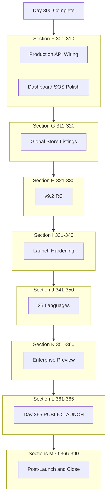

# ZapSafe Frontend — Days 301-390 DETAILED INSTRUCTIONS
## Complete Step-by-Step Explanations (No Code — AI Builds It)

**Purpose:** Day-by-day build spec for **Days 301-390** so any AI agent can implement launch, production wiring, and post-launch work without guessing context.

**Project path:** `C:\Users\hridy\Desktop\zapsafe\letsstartbuilding\zapsafe_mobile`

**Starting point:** Day 300 complete (`day300_halfway_launch_milestone_screen.dart` — 293 unique `day*_*.dart` screens, Days 1-300).

**Backend status at start:** ~Day 101 (analytics Days 81-90 ✅, Razorpay Day 100 ✅, MSG91 cascade Day 101 ✅). Privacy/account APIs (Days 151-200 contracts) and police/referral/journey APIs still mostly **mock**.

**Phase goal:** Finish the **390-day frontend project** — global public launch by **Day 365**, post-launch stabilization through **Day 390**.

**Total duration:** 90 days (Days 301-390)

**New screens / flows:** ~90 day-screens (one primary deliverable per day) + production wiring on existing `auth/`, `onboarding/`, and core SOS flows

**New subscriptions needed:** **ZERO** for coding (Apple $99/yr + Play $25 already paid). Optional: Sentry Pro if crash volume exceeds free tier post-launch.

---

## 📱 SCOPE: PHONE-ONLY (carry forward from Days 201-300)

| In scope | Out of scope (defer to v9.2+) |
|----------|--------------------------------|
| Android + iOS Flutter app | Apple Watch / Wear OS apps |
| Home screen widgets (already Day 256-257) | Wearable pairing backend |
| Production API wiring where backend exists | Full enterprise SSO server |
| Store submission + staged rollout UI | Native watch complications |

---

## ⚠️ WHAT DAYS 201-300 ALREADY BUILT (DO NOT REBUILD)

These exist as **demo/day-screens**. Days 301-390 **wire them to production** or **execute** their checklists — do not duplicate:

| Feature | Built on days | Production path |
|---------|---------------|-----------------|
| Police dashboard UI | 221-223 | Wire when backend adds police APIs |
| Stealth / decoy / hidden mode | 230-235 | Local OS — promote to Settings |
| Group journey map | 251-252 | Mock → journey APIs |
| Family SOS history | 254 | Mock → family APIs |
| Hearing impaired visual | 246 | Promote to Settings → Accessibility |
| Siri / voice shortcuts | 248-249 | Platform channels — verify on device |
| Language packs (stubs) | 261-268 | Expand to full 25 languages Days 341-350 |
| Launch prep (press kit, store notes, go/no-go) | 281-298 | **Execute** for real submission Days 361-365 |
| Post-launch / hotfix previews | 292-294 | **Execute** Days 366-385 |

---

## CONFLICT TAGS (same as Days 201-300)

| Tag | Meaning | AI action |
|-----|---------|-----------|
| 🟢 **FRONTEND-ONLY** | No backend. Checklists, static UI, local storage. | Build fully now. |
| 🟡 **MOCK-NOW** | API contract documented; backend not live. | Mock + contract; swap when live. |
| 🔵 **EXISTING-API** | Backend live (auth, SOS, analytics, Razorpay, cascade). | Wire `api_client` / services. |
| 🟣 **POLISH** | Improve production screens (`auth/`, dashboard, SOS). | Edit existing production files. |
| 🔗 **WIRE** | Connect day-screen demo → production service layer. | Extract service; delete duplicate logic later. |

### Backend live at Day 101 (use 🔵)

- Auth, SOS trigger, contacts, notifications, GPS, evidence metadata
- Analytics: `/api/v1/analytics/sos-summary/`, `detections/`, `contacts/response-rate/`, `device-health/`
- Razorpay: subscription create/status/cancel + webhook
- MSG91 cascade: push → SMS routing; `GET /api/v1/sos/<id>/delivery-status/`
- i18n: `/api/v1/i18n/languages/` (Accept-Language on Day 103 backend — wire when live)

### Backend NOT live (use 🟡)

- Account: consent, export, deletion, audit-log, retention, sessions (Days 151-200 contracts)
- Police, referral, group journey, family dashboard, enterprise SSO, insurance APIs

---

## STANDARD DELIVERABLES (EVERY DAY)

For **each** Day 301-390, the AI agent MUST:

1. Create `lib/presentation/screens/day{N}_{snake_case}_screen.dart` (unless 🟣-only — then document edited files in day meta-screen).
2. Add route constant in `lib/presentation/navigation/app_router.dart`.
3. Register `GoRoute` in same file.
4. Add `_NavTile` in `day5_navigation_index_screen.dart` (Day 35+ rule).
5. Add strings to `assets/translations/en.json` (+ `hi.json` for user-facing launch copy).
6. File header per template below.
7. Run `flutter analyze` on touched files — zero new errors.

### File header template

```dart
/// Day {N} — {Short title}
///
/// {One paragraph: what this screen does}
/// Tag: 🟢 | 🟡 | 🔵 | 🟣 | 🔗
///
/// Route: {AppRoutes.constant}
library;
```

### Progress strip update

On Day 365 and Day 390, update `day5_navigation_index_screen.dart` progress strip from `Day 300 / 365` → `Day 365 / 390` (final).

---

## TABLE OF CONTENTS

1. [Section F: Production Wiring (Days 301-310)](#section-f-production-wiring-days-301-310)
2. [Section G: Global Store Expansion (Days 311-320)](#section-g-global-store-expansion-days-311-320)
3. [Section H: v9.2 Core & RC (Days 321-330)](#section-h-v92-core--rc-days-321-330)
4. [Section I: Launch Hardening (Days 331-340)](#section-i-launch-hardening-days-331-340)
5. [Section J: 25-Language Completion (Days 341-350)](#section-j-25-language-completion-days-341-350)
6. [Section K: Enterprise & B2B (Days 351-360)](#section-k-enterprise--b2b-days-351-360)
7. [Section L: Public Launch Week (Days 361-365)](#section-l-public-launch-week-days-361-365)
8. [Section M: Post-Launch Week 1 (Days 366-375)](#section-m-post-launch-week-1-days-366-375)
9. [Section N: Scale & Stabilize (Days 376-385)](#section-n-scale--stabilize-days-376-385)
10. [Section O: Project Close (Days 386-390)](#section-o-project-close-days-386-390)
11. [API Contracts](#api-contracts-summary)
12. [Milestone Checklists](#milestone-checklists)

---

# SECTION F: PRODUCTION WIRING (Days 301-310)

**Goal:** Stop relying on mocks for APIs that **already exist** on backend Day 101. Promote top HANDOFF UI improvements into **production** screens (not just day-demos).

---

## Day 301: Backend Integration Audit Hub 🔗 FRONTEND-ONLY

### What This Screen Does
Master dashboard listing every frontend API call across the app. Each row: endpoint, current status (live / mock / missing), file path, last tested date, pass/fail toggle.

### Why It Matters
Days 1-300 built fast with mocks. Before launch, you need a single place to track what still points at `MockDataProvider`.

### User Flow
1. Open Day 301 from nav index.
2. See grouped sections: Auth, SOS, Contacts, Analytics, Premium, Notifications, Privacy.
3. Tap row → shows expected JSON + "Test now" button (calls real API if 🔵).
4. Export audit JSON to clipboard.

### What To Build
- `IntegrationAuditEntry` model: `endpoint`, `method`, `status` (live|mock|missing), `sourceFile`, `lastResult`.
- Seed list from `DAYS_201_300` API contracts + `DAYS_151_200` account APIs.
- Summary cards: X live, Y mock, Z missing.
- CTA: "Start Day 302 wiring sprint".

### Files
- `day301_backend_integration_audit_screen.dart`
- Route: `/day-301-integration-audit`

### Acceptance Criteria
- [ ] ≥40 endpoints listed (minimum from docs)
- [ ] Color code: green=live, amber=mock, red=missing
- [ ] Share/export works offline

### Time: 1 day

---

## Day 302: Wire Analytics APIs 🔵 EXISTING-API

### What This Screen Does
Meta-screen + service layer: connect Alert Dashboard (Day 77-78) and any analytics widgets to **live** analytics endpoints.

### APIs to Wire
```
GET /api/v1/analytics/sos-summary/
GET /api/v1/analytics/detections/
GET /api/v1/analytics/contacts/response-rate/
GET /api/v1/analytics/device-health/  (GET + POST)
```

### What To Build
- `lib/data/services/analytics_api_service.dart` (if not exists — create; else extend).
- Replace mock providers in dashboard-related screens with `FutureProvider` hitting real API.
- Day 302 screen shows before/after: mock vs live data side-by-side for QA.
- Error states: 401 → login, 500 → retry, empty → empty widget from Day 212.

### Files
- `day302_analytics_live_wire_screen.dart`
- Edit: dashboard / alert dashboard providers as needed.

### Acceptance Criteria
- [ ] All 4 analytics endpoints called successfully against dev/staging backend
- [ ] `USE_MOCK_DATA` flag still works for offline dev
- [ ] Day 301 audit marks analytics rows green

### Time: 1 day

---

## Day 303: Wire Razorpay Premium Flow 🔵 EXISTING-API

### What This Screen Does
Connect premium subscription UI (Days 91-100 screens) to live Razorpay endpoints from backend Day 100.

### APIs to Wire
```
POST /api/v1/subscription/create/
GET  /api/v1/subscription/status/
POST /api/v1/subscription/cancel/
```

### What To Build
- `PremiumSubscriptionService` using real JWT auth headers.
- Show contact limit (3 free / unlimited premium) from status payload.
- Day 303 screen: test checkout flow with Razorpay test mode keys (document manual step).
- Surface `storage_limit_mb`, `sms_priority` from status API.

### Files
- `day303_razorpay_live_wire_screen.dart`
- Edit: premium / subscription screens in production path.

### Acceptance Criteria
- [ ] Status API drives UI tier badge on dashboard
- [ ] Cancel flow updates local state
- [ ] Graceful fallback if Razorpay keys unset

### Time: 1 day

---

## Day 304: Wire SOS Delivery Status (MSG91 Cascade) 🔵 EXISTING-API

### What This Screen Does
Connect Delivery Confirmation screen (Day 75) to live per-contact delivery logs from Day 101 cascade.

### APIs to Wire
```
GET /api/v1/sos/<sos_id>/delivery-status/
```
Response must include per contact: `channel` (push|sms|email), `provider` (fcm|msg91|twilio), `status`, `timestamp`.

### What To Build
- Poll delivery status every 5s for 60s after SOS trigger (Riverpod timer).
- Show India contacts with MSG91 provider badge; US with Twilio.
- Day 304 screen demonstrates full cascade story with last real SOS id (or mock id in dev).

### Files
- `day304_delivery_status_live_wire_screen.dart`
- Edit: delivery confirmation production widget.

### Acceptance Criteria
- [ ] Provider field visible per contact row
- [ ] Hindi push template used when `user.language == 'hi'` (when Day 104 backend live)
- [ ] Day 301 audit: delivery endpoint green

### Time: 1 day

---

## Day 305: Accept-Language Header Wiring 🔗 WIRE

### What This Screen Does
Ensure **all** authenticated API calls send `Accept-Language` from `i18nProvider.selectedCode`. Demo screen verifies headers via intercept log.

### What To Build
- Centralize in `api_client.dart` / Dio interceptor: `Accept-Language: {locale}`.
- Day 305 screen: toggle language → fire test calls → show captured headers.
- Document dependency on backend Day 103 `LocaleMiddleware` (until live, expect English fallback).

### Files
- `day305_accept_language_wire_screen.dart`
- Edit: HTTP client interceptor.

### Acceptance Criteria
- [ ] OTP verify sends `hi` when app locale is Hindi
- [ ] Error messages ready to display Hindi when backend Day 103 ships

### Time: 1 day

---

## Day 306: Production Notification Tiers 🟣 POLISH

### What This Screen Does
Implement HANDOFF Improvement #1 on **production dashboard** (not demo-only).

### What To Build
Three-tier banner system on main dashboard:
- **Critical** (red): battery <10%, evidence storage full — must acknowledge
- **Important** (orange): unverified Tier-2 contact — dismissible
- **Suggestion** (blue): monthly drill reminder — low priority

### Files
- `day306_notification_tiers_polish_screen.dart` (documents changes)
- Edit: production dashboard scaffold.

### Acceptance Criteria
- [ ] Only one critical banner at a time
- [ ] Acknowledge persists in local Hive until condition clears
- [ ] 75dp touch targets on dismiss/ack buttons

### Time: 1 day

---

## Day 307: Production SOS Long-Press Ring 🟣 POLISH

### What This Screen Does
HANDOFF Improvement #3 — circular fill animation on SOS button (production SOS screen).

### What To Build
- 2-second long-press with clockwise ring fill gray → red
- Haptic ramp: light → medium → heavy
- Release early → "Cancelled" flash 300ms
- Day 307 meta-screen links to production SOS route for QA steps

### Files
- `day307_sos_longpress_ring_screen.dart`
- Edit: production SOS trigger widget.

### Acceptance Criteria
- [ ] Works on Android + iOS
- [ ] TalkBack announces "Hold to activate SOS, 2 seconds remaining"

### Time: 1 day

---

## Day 308: Production Persistent Status Card 🟣 POLISH

### What This Screen Does
HANDOFF Improvement #2 — floating status card on dashboard.

### What To Build
- Collapsed card: mode badge + battery + last DCS score
- Expanded: GPS quality, monitoring state, tier, premium badge
- Drag-to-dismiss not allowed (persistent); tap to expand only

### Files
- `day308_persistent_status_card_screen.dart`
- Edit: dashboard layout.

### Acceptance Criteria
- [ ] Does not overlap SOS button (min 16dp gap)
- [ ] Updates on `AppStateNotifier` transitions

### Time: 1 day

---

## Day 309: Production Evidence Vault Search 🟣 POLISH

### What This Screen Does
HANDOFF Improvement #5 — filters on evidence vault production screen.

### What To Build
- Filter chips: date range, trigger type (manual/AI/fall), status (resolved/FP/drill), tamper flag
- Search by SOS id prefix
- Empty state when no matches (reuse Day 212 patterns)

### Files
- `day309_evidence_vault_search_screen.dart`
- Edit: evidence vault production list.

### Acceptance Criteria
- [ ] Filters work on local Hive/cache data offline
- [ ] Combine filters with AND logic

### Time: 1 day

---

## Day 310: Section F Milestone — Integration Complete 🔗

### What This Screen Does
Celebration + checklist: all Day 301-309 wiring tasks verified.

### What To Build
- Checklist mirrors Day 301 audit (all 🔵 rows green or documented exception)
- Stat grid: APIs wired, polish items shipped
- Timeline: Section F complete → Section G begins
- Route: `/day-310-section-f-milestone`

### Files
- `day310_section_f_milestone_screen.dart`

### Acceptance Criteria
- [ ] Links to Day 301 audit with refreshed counts
- [ ] Nav tile + route registered

### Time: 1 day

---

# SECTION G: GLOBAL STORE EXPANSION (Days 311-320)

**Goal:** Prepare ZapSafe for **EU, LATAM, and SEA** store listings (extends Day 238/291 India work).

---

## Day 311: EU Emergency Numbers Pack 🟢 FRONTEND-ONLY

### What This Screen Does
Editor + viewer for EU country emergency numbers (112 universal + country overrides).

### What To Build
- JSON asset `assets/data/emergency_eu.json` — 27 EU countries
- Screen to preview numbers per country; link from region settings
- Integrate with existing `day238_region_emergency_numbers_screen.dart` pattern

### Files
- `day311_eu_emergency_numbers_screen.dart`
- `assets/data/emergency_eu.json`

### Time: 1 day

---

## Day 312: LATAM Emergency Numbers Pack 🟢

### Countries: Mexico, Brazil, Colombia, Argentina, Chile (+5 more)
### Files: `day312_latam_emergency_numbers_screen.dart`, `assets/data/emergency_latam.json`

---

## Day 313: SEA Emergency Numbers Pack 🟢

### Countries: Singapore, Malaysia, Indonesia, Philippines, Vietnam, Thailand
### Files: `day313_sea_emergency_numbers_screen.dart`, `assets/data/emergency_sea.json`

---

## Day 314: Play Store EU Listing Copy Generator 🟢

### What To Build
- Form generates: title (30 char), short desc (80), full desc (4000) for en/de/fr/es
- Copy-to-clipboard per field
- References LP27 privacy in description template

### Files: `day314_play_store_eu_listing_screen.dart`

---

## Day 315: App Store EU Localization Pack 🟢

### What To Build
- Same as Day 314 but Apple field limits (subtitle 30, keywords 100)
- Screenshots size guide (6.7", 6.5", iPad)

### Files: `day315_app_store_eu_listing_screen.dart`

---

## Day 316: Play Console Staged Rollout Controller 🟢

### What To Build
- UI simulating Play staged rollout: 5% → 10% → 25% → 50% → 100%
- Document manual steps in Play Console (no API — FRONTEND-ONLY checklist)
- Country targeting: India first, then EU bundle

### Files: `day316_play_staged_rollout_screen.dart`

---

## Day 317: App Store Phased Release Controller 🟢

### What To Build
- Phased release day-by-day schedule table
- TestFlight group mapping (internal / beta / production)
- Export runbook markdown

### Files: `day317_app_store_phased_release_screen.dart`

---

## Day 318: Regional Pricing Matrix 🟢

### What To Build
- Table: country → premium monthly price (₹99 India, $4.99 US, €4.49 EU)
- PPP notes for India tier
- Razorpay vs App Store IAP column (document which markets use which)

### Files: `day318_regional_pricing_matrix_screen.dart`

---

## Day 319: GDPR Consent Flow Wire 🟡 MOCK-NOW

### What This Screen Does
Wire Settings → Consent toggles to account consent API (when backend ships).

### API Contract
```
GET  /api/v1/account/consent/
PUT  /api/v1/account/consent/
Body: { "analytics": bool, "marketing": bool, "location_history": bool, ... }
```

### What To Build
- Until live: Hive local storage (same as Days 155-157)
- Day 319 screen: migration plan mock→API toggle
- Show GDPR lawful basis text per toggle

### Files: `day319_gdpr_consent_wire_screen.dart`

---

## Day 320: Section G Milestone — Global Listings Ready 🟢

### Checklist: EU/LATAM/SEA numbers, listing copy, rollout runbooks complete.
### Files: `day320_section_g_milestone_screen.dart`

---

# SECTION H: v9.2 CORE & RC (Days 321-330)

**Goal:** Production-quality SOS/DCS pipeline + Release Candidate build manifest.

---

## Day 321: SOS Trigger Production Refactor 🔗

### What To Build
- Extract SOS trigger logic from day-screens into `lib/domain/sos/sos_trigger_controller.dart`
- Single entry: manual, fall, DCS auto, duress PIN
- Unit tests for state transitions
- Meta-screen documents file moves

### Files: `day321_sos_trigger_refactor_screen.dart`, new controller file.

---

## Day 322: DCS Pipeline Production Wire 🔗

### What To Build
- Wire `DCSScoreWatcher` → `TriggerOrchestrator` → production dashboard (already Day 39 — verify end-to-end on device)
- Load real TFLite models from `assets/models/` (not placeholders) where available
- Log scores to `POST` detection log if endpoint exists

### Files: `day322_dcs_pipeline_wire_screen.dart`

---

## Day 323: Journey Mode ML Confidence UI 🟡 MOCK-NOW

### API Contract (future)
```
POST /api/v1/journey/session/start/
GET  /api/v1/journey/session/{id}/risk-score/
```

### What To Build
- Journey mode card on dashboard with confidence meter 0-100
- Mock risk score from GPS speed + time-of-day heuristic until API live

### Files: `day323_journey_ml_confidence_screen.dart`

---

## Day 324: Release Candidate Build Manifest 🟢

### What To Build
- Screen lists: app version, build number, git hash, model versions (from `model_registry`), feature flags
- QR code for APK/IPA download URL (mock)
- "RC checklist" — all sections F-I green

### Files: `day324_release_candidate_manifest_screen.dart`

---

## Day 325: OTA Model Update UI 🔵 EXISTING-API

### API: `GET /api/v1/models/get-version/`

### What To Build
- Compare bundled model version vs server → show update available banner
- Download progress mock (real OTA per `OTA_UPDATES_FOR_LATER.md` — UI only now)

### Files: `day325_ota_model_update_screen.dart`

---

## Day 326: Cold Start Optimization Report 🟢

### What To Build
- Instrumented splash → dashboard timing display
- Target: <2s cold start on Galaxy A12 equivalent
- List top 5 slow init steps with recommendations

### Files: `day326_cold_start_report_screen.dart`

---

## Day 327: Memory Leak Fix Tracker 🟣

### What To Build
- Table of known leak suspects (streams not disposed, FGS bindings)
- Pass/fail from DevTools snapshot instructions
- Link to Day 217 profiling screen

### Files: `day327_memory_leak_tracker_screen.dart`

---

## Day 328: Battery Profile — MONITORING Mode Production 🟣

### What To Build
- Verify battery tiers (80/18/13/7) on production background service
- 1-hour sample log export
- Compare to Day 297 soak template

### Files: `day328_battery_monitoring_production_screen.dart`

---

## Day 329: False Positive Tuning — Production 🟣

### What To Build
- Settings slider for DCS threshold (user-facing, with warnings)
- Sync preference to backend device-health POST
- Extends Day 258 fall detection tuning

### Files: `day329_false_positive_tuning_production_screen.dart`

---

## Day 330: Section H Milestone — v9.2 RC Ready 🟢

### Files: `day330_section_h_rc_milestone_screen.dart`

---

# SECTION I: LAUNCH HARDENING (Days 331-340)

**Goal:** Execute (not just preview) go/no-go, regression, security, legal gates from Days 285-298.

---

## Day 331: Go/No-Go Gate v2 🟢

### What To Build
- Extend Day 298 checklist from 22 → 40 items
- Add Section F wiring items + RC manifest (Day 324)
- All items must pass for launch approval; export PDF text

### Files: `day331_gonogo_gate_v2_screen.dart`

---

## Day 332: Full 300-Screen Regression Runner v2 🟢

### What To Build
- Extend Day 289 regression routes to include Days 301-331
- Auto-test: route resolves, no throw, semantics present
- Summary: pass / fail / skip counts

### Files: `day332_regression_runner_v2_screen.dart`, update `day289_full_regression_routes.part.dart`

---

## Day 333: Platform Parity Audit — Execution 🟢

### What To Build
- Run Day 296 matrix; mark each row PASS/FAIL with device notes
- Blockers list for iOS or Android

### Files: `day333_platform_parity_execution_screen.dart`

---

## Day 334: Battery Soak — Production Log 🟢

### What To Build
- Execute Day 297 8-hour soak template on real device
- Form fields: start %, end %, drain rate, thermal throttling Y/N

### Files: `day334_battery_soak_production_screen.dart`

---

## Day 335: Accessibility Full-App Pass 🟢

### What To Build
- 44 production flows × TalkBack/VoiceOver script
- WCAG AAA touch target verification
- Extends Day 214 audit

### Files: `day335_accessibility_full_pass_screen.dart`

---

## Day 336: Security Pre-Launch — Execution 🟢

### What To Build
- Execute Day 285 OWASP MASVS L2 checklist
- Mark certificate pinning, FLAG_SECURE, root detection items

### Files: `day336_security_execution_screen.dart`

---

## Day 337: Legal Blockers Live Tracker 🟡 MOCK-NOW

### What To Build
- Wire Day 286 tracker to ping account APIs (export, delete) when available
- Red/yellow/green per DPDP requirement

### Files: `day337_legal_blockers_live_screen.dart`

---

## Day 338: Sentry Crash-Free — Live Wire 🔵

### What To Build
- When `SENTRY_DSN` set, show real crash-free rate from Sentry API (or manual paste)
- Target: 99.5% per Day 288

### Files: `day338_sentry_live_wire_screen.dart`

---

## Day 339: Beta Feedback Round 4 🟣

### What To Build
- Survey: NPS, SOS confidence, false positive rate since RC
- Submit to analytics POST (custom event) or local log

### Files: `day339_beta_feedback_round4_screen.dart`

---

## Day 340: Section I Milestone — Hardening Complete 🟢

### Files: `day340_section_i_milestone_screen.dart`

---

# SECTION J: 25-LANGUAGE COMPLETION (Days 341-350)

**Goal:** Expand from 15 → **25 languages** (HANDOFF target). Days 261-268 added stubs; this section completes JSON + QA.

### Languages 16-25 (add to `assets/translations/`)

| # | Code | Language |
|---|------|----------|
| 16 | sw | Swahili |
| 17 | id | Indonesian |
| 18 | th | Thai |
| 19 | vi | Vietnamese |
| 20 | tr | Turkish |
| 21 | pl | Polish |
| 22 | nl | Dutch |
| 23 | it | Italian |
| 24 | ko | Korean |
| 25 | fa | Persian (RTL — extend Day 263) |

---

## Day 341: Languages 16-18 Full JSON 🟢

### What To Build
- Complete `sw.json`, `id.json`, `th.json` — all namespaces from `en.json` (not just stubs)
- Language selector shows 18 languages

### Files: `day341_languages_16_18_screen.dart`, translation files.

---

## Day 342: Languages 19-21 Full JSON 🟢

### Files: `vi.json`, `tr.json`, `pl.json` + `day342_languages_19_21_screen.dart`

---

## Day 343: Languages 22-25 Full JSON 🟢

### Files: `nl.json`, `it.json`, `ko.json`, `fa.json` + `day343_languages_22_25_screen.dart`

---

## Day 344: RTL Regression — 25 Languages 🟢

### What To Build
- Test ar, ur, fa RTL layouts on 5 critical screens
- Mirror icons where needed; no overflow at 200% font scale

### Files: `day344_rtl_25lang_regression_screen.dart`

---

## Day 345: i18n Missing Key Scanner 🟢

### What To Build
- Script/UI: diff each locale JSON vs `en.json` keys
- Show missing key count per language; export report

### Files: `day345_i18n_missing_key_scanner_screen.dart`

---

## Day 346: Cultural Adaptation QA v2 🟢

### Extends Day 269 — per-region color/icon appropriateness review checklist.

### Files: `day346_cultural_adaptation_v2_screen.dart`

---

## Day 347: Hindi/Tamil/Telugu Production Copy Review 🟢

### What To Build
- Native speaker review flags on critical strings (SOS, legal, onboarding)
- Mark approved/revise per string id

### Files: `day347_indic_copy_review_screen.dart`

---

## Day 348: Voice Trigger Keywords — 25 Languages 🟢

### What To Build
- Map hidden voice SOS keywords per locale
- Store in `assets/data/voice_keywords.json`

### Files: `day348_voice_keywords_25lang_screen.dart`

---

## Day 349: Multi-Language Store Screenshots Generator 🟢

### What To Build
- Frame mockups showing app in hi/ta/te/en for store assets
- Export asset manifest for designer

### Files: `day349_store_screenshots_i18n_screen.dart`

---

## Day 350: Section J Milestone — 25 Languages Complete 🟢

### Files: `day350_section_j_25lang_milestone_screen.dart`

---

# SECTION K: ENTERPRISE & B2B (Days 351-360)

**Goal:** Enterprise preview UIs (mock) + wire family/referral/police when APIs ready.

---

## Day 351: Enterprise SSO Login Preview 🟡 MOCK-NOW

### API Contract (future)
```
GET  /api/v1/enterprise/sso/providers/
POST /api/v1/enterprise/sso/start/
```

### Files: `day351_enterprise_sso_preview_screen.dart`

---

## Day 352: Insurance Partnership API Wire 🟡 MOCK-NOW

### Extends Day 272 — wire when `GET /api/v1/partners/insurance/` exists.

### Files: `day352_insurance_api_wire_screen.dart`

---

## Day 353: B2B Admin Portal Preview 🟡 MOCK-NOW

### Mock dashboard: org users, SOS count, response SLA.

### Files: `day353_b2b_admin_preview_screen.dart`

---

## Day 354: Family Dashboard Production Wire 🟡 MOCK-NOW

### API: `GET /api/v1/family/dashboard/` — wire Day 254 mock.

### Files: `day354_family_dashboard_wire_screen.dart`

---

## Day 355: Referral Production Wire 🟡 MOCK-NOW

### API: `GET /api/v1/referral/code/`, `GET /api/v1/referral/stats/`

### Files: `day355_referral_live_wire_screen.dart`

---

## Day 356: Police Dispatch Production Wire 🟡 MOCK-NOW

### APIs from Days 221-223 — wire dispatch status polling.

### Files: `day356_police_dispatch_wire_screen.dart`

---

## Day 357: Group Journey Production Wire 🟡 MOCK-NOW

### APIs from Day 251 — create session, live map, panic POST.

### Files: `day357_group_journey_wire_screen.dart`

---

## Day 358: Premium Tier Production Polish 🟣

### Unify premium badges across dashboard, settings, contact limit CTAs.

### Files: `day358_premium_polish_screen.dart`

---

## Day 359: Enterprise Sales Deck In-App 🟢

### Swipeable deck: problem, solution, pricing, contact — for B2B meetings.

### Files: `day359_enterprise_sales_deck_screen.dart`

---

## Day 360: Section K Milestone — Enterprise Preview Complete 🟢

### Files: `day360_section_k_milestone_screen.dart`

---

# SECTION L: PUBLIC LAUNCH WEEK (Days 361-365)

**Goal:** **Day 365 = PUBLIC LAUNCH 🚀** (per `ZAPSAFE_MASTER_HANDOFF.md` and Day 300 timeline).

---

## Day 361: Final QA War Room 🟢

### What To Build
- Single screen with live checklist toggles synced across team (export share sheet)
- P0/P1/P2 bug buckets
- Block launch if any P0 open

### Files: `day361_final_qa_war_room_screen.dart`

---

## Day 362: Play Store Submission Executor 🟢

### What To Build
- Step-by-step Play Console wizard (checkbox UI)
- Tracks: content rating, data safety, target API level, signed AAB upload
- Link to Day 316 rollout plan

### Files: `day362_play_store_submission_screen.dart`

---

## Day 363: App Store Submission Executor 🟢

### What To Build
- App Store Connect steps: archive, upload, review info, demo account
- Paste fields from Day 284 review notes generator

### Files: `day363_app_store_submission_screen.dart`

---

## Day 364: Launch Day Runbook 🟢

### What To Build
- Minute-by-minute launch day schedule (T-24h → T+24h)
- Roles: founder, intern, support macros (Day 294)
- SOS monitoring escalation path

### Files: `day364_launch_day_runbook_screen.dart`

---

## Day 365: PUBLIC LAUNCH MILESTONE 🚀 🟢

### What This Screen Does
**The** Day 365 deliverable — global public launch celebration (bigger than Day 300).

### What To Build
- 3-tab: **Launch** | **Live Stats** | **Thank You**
- Confetti + haptic on open
- Timeline: Day 1 → 100 → 200 → 300 → **365 LAUNCH**
- Stat grid: 365 days, 390 target, 25 languages, countries live
- Share message template for social
- CTA: "Monitor post-launch" → Day 366

### Files
- `day365_public_launch_milestone_screen.dart`
- Route: `/day-365-public-launch`
- Update nav progress strip: `Day 365 / 390`

### Acceptance Criteria
- [ ] Hero badge: `DAY 365 · PUBLIC LAUNCH`
- [ ] Links forward to Section M (Days 366-375)

### Time: 1 day

---

# SECTION M: POST-LAUNCH WEEK 1 (Days 366-375)

**Goal:** First 10 days after store live — monitor, hotfix, learn.

---

## Day 366: Live SOS Success Dashboard 🟡 MOCK-NOW

### Metrics: SOS triggered, delivery success %, avg ack time. Wire analytics when available.

### Files: `day366_live_sos_dashboard_screen.dart`

---

## Day 367: Ratings & Reviews Monitor 🟢

### Manual paste from Play/App Store; sentiment tags; respond templates.

### Files: `day367_ratings_reviews_monitor_screen.dart`

---

## Day 368: Hotfix Release Executor 🔗

### Execute Day 293 playbook — version bump, changelog, staged rollout 5%.

### Files: `day368_hotfix_executor_screen.dart`

---

## Day 369: Support Ticket Triage 🟢

### Kanban: new / investigating / resolved — uses Day 294 macros.

### Files: `day369_support_triage_screen.dart`

---

## Day 370: Week 1 Retrospective 🟢

### What went well / bugs / user quotes / action items.

### Files: `day370_week1_retrospective_screen.dart`

---

## Day 371: Staged Rollout 50% → 100% 🟢

### Execute rollout increase checklist (Play + App Store).

### Files: `day371_rollout_100_screen.dart`

---

## Day 372: Performance at Scale Report 🟢

### DAU mock, API latency paste, error rate — readiness for 10K users.

### Files: `day372_performance_scale_screen.dart`

---

## Day 373: False Positive Field Analysis 🟢

### User-reported FP categorization; link to Day 329 tuning.

### Files: `day373_false_positive_field_screen.dart`

---

## Day 374: Model Retrain Feedback Export 🟢

### Export anonymized misclassification bundle for Kaggle retrain (CSV JSON).

### Files: `day374_model_feedback_export_screen.dart`

---

## Day 375: Section M Milestone — Week 1 Stable 🟢

### Files: `day375_section_m_milestone_screen.dart`

---

# SECTION N: SCALE & STABILIZE (Days 376-385)

**Goal:** Month 10 ops per `TIMELINE_FROM_DAY71.md` Days 257-286.

---

## Day 376: Month 10 Ops Milestone 🟢

### Files: `day376_month10_ops_screen.dart`

---

## Day 377: v9.2 Feature Backlog Lock 🟢

### Prioritize wearables deferral, counselor chat, federated learning.

### Files: `day377_v92_backlog_screen.dart`

---

## Day 378: Competitor Benchmark Update 🟢

### Feature matrix vs Life360, Noonlight, bSafe — update positioning.

### Files: `day378_competitor_benchmark_screen.dart`

---

## Day 379: 10K Users Readiness Gate 🟢

### Infra checklist (backend responsibility — frontend documents expectations).

### Files: `day379_10k_users_gate_screen.dart`

---

## Day 380: Day 380 Ops Checkpoint 🟢

### Note: **380** is an ops checkpoint day in this plan — not total project length.

### Files: `day380_ops_checkpoint_screen.dart`

---

## Day 381: Hotfix v1.0.1 Release 🟢

### Files: `day381_hotfix_v101_screen.dart`

---

## Day 382: Hotfix v1.0.2 Release 🟢

### Files: `day382_hotfix_v102_screen.dart`

---

## Day 383: Privacy Audit Follow-Up 🟢

### Files: `day383_privacy_audit_followup_screen.dart`

---

## Day 384: DPDP Compliance Sign-Off 🟡 MOCK-NOW

### Wire when export/delete APIs live.

### Files: `day384_dpdp_signoff_screen.dart`

---

## Day 385: Support Macros — Production 🟢

### Promote Day 294 macros to in-app support tool.

### Files: `day385_support_macros_production_screen.dart`

---

# SECTION O: PROJECT CLOSE (Days 386-390)

**Goal:** Close the **390-day frontend project** arc (`HANDOFF.md` / `TIMELINE_FROM_DAY71.md`).

---

## Day 386: Analytics Month 1 Report 🟢

### Files: `day386_analytics_month1_screen.dart`

---

## Day 387: Year in Review v2 🟢

### Extends Day 275 with launch month stats.

### Files: `day387_year_in_review_v2_screen.dart`

---

## Day 388: v9.2 Roadmap Lock 🟢

### Files: `day388_v92_roadmap_lock_screen.dart`

---

## Day 389: Day 389 Penultimate Summary 🟢

### Files: `day389_penultimate_summary_screen.dart`

---

## Day 390: PROJECT COMPLETE MILESTONE 🏁 🟢

### What This Screen Does
Final screen of the 390-day frontend plan — celebration + handoff to v9.2 maintenance.

### What To Build
- Timeline: Day 1 → 365 Launch → **390 Complete**
- Stats: 390 days, ~390 screens, 25 languages, sections F-O complete
- Teaser: v9.2 wearables optional (Month 14+)
- Update nav strip: `Day 390 / 390` (100%)

### Files
- `day390_project_complete_milestone_screen.dart`
- Route: `/day-390-project-complete`

### Acceptance Criteria
- [ ] All Days 301-390 routes registered
- [ ] `HANDOFF.md` updated to Day 390 complete
- [ ] Regression runner includes full 390 routes

### Time: 1 day

---

# API CONTRACTS SUMMARY

### Already live (wire in Section F) 🔵
```
GET  /api/v1/analytics/sos-summary/
GET  /api/v1/analytics/detections/
GET  /api/v1/analytics/contacts/response-rate/
GET  /api/v1/analytics/device-health/
POST /api/v1/analytics/device-health/
POST /api/v1/subscription/create/
GET  /api/v1/subscription/status/
POST /api/v1/subscription/cancel/
GET  /api/v1/sos/<id>/delivery-status/
GET  /api/v1/models/get-version/
GET  /api/v1/i18n/languages/
```

### Still mock until backend catches up 🟡
```
PUT/GET  /api/v1/account/consent/
POST/GET /api/v1/account/export-request/
POST     /api/v1/account/delete-request/
GET      /api/v1/account/audit-log/
PUT      /api/v1/account/retention/
GET/DEL  /api/v1/account/sessions/
GET      /api/v1/police/connection/
POST     /api/v1/police/connection/request/
GET      /api/v1/police/dispatch/{sos_id}/
GET      /api/v1/referral/code/
GET      /api/v1/referral/stats/
POST     /api/v1/journey/group/create/
GET      /api/v1/journey/group/{session_id}/
POST     /api/v1/journey/group/{session_id}/panic/
GET      /api/v1/family/dashboard/
GET      /api/v1/family/members/{id}/sos-history/
GET      /api/v1/enterprise/sso/providers/
POST     /api/v1/enterprise/sso/start/
GET      /api/v1/partners/insurance/
```

---

# MILESTONE CHECKLISTS

## Day 365 Launch Checklist (AI must verify)

- [ ] Go/No-Go v2 (Day 331) — all P0 green
- [ ] Play + App Store submission executors completed (362-363)
- [ ] 25 languages (Day 350) — missing keys = 0 for hi/en
- [ ] Analytics + Razorpay + delivery status wired (302-304)
- [ ] Production SOS polish (306-307) on main user path
- [ ] Security execution (336) — no open critical items
- [ ] `day365_public_launch_milestone_screen.dart` shipped

## Day 390 Complete Checklist

- [ ] `day301` through `day390` exist (90 files)
- [ ] Each has route + nav tile
- [ ] Regression runner v2 passes ≥95% routes
- [ ] `HANDOFF.md` status: Day 390 / 390
- [ ] Post-launch week 1 retrospective (370) filed
- [ ] v9.2 roadmap (388) documented

---

## ARCHITECTURE (Mermaid)



---

**Ready for:** AI agent to build Days 301-390 independently.

**Sources used:** `DAYS_201_300_DETAILED_INSTRUCTIONS.md`, `ZAPSAFE_MASTER_HANDOFF.md` Part 9, `ORIGINAL_PLAN_DAY_201_390.md`, `TIMELINE_FROM_DAY71.md`, `day300_halfway_launch_milestone_screen.dart`, `CHANGELOG_MONTH_04.md` (backend Day 101).

**After Day 390:** Maintenance + v9.2 features (wearables optional) — new doc `DAYS_391_450` if needed later.
